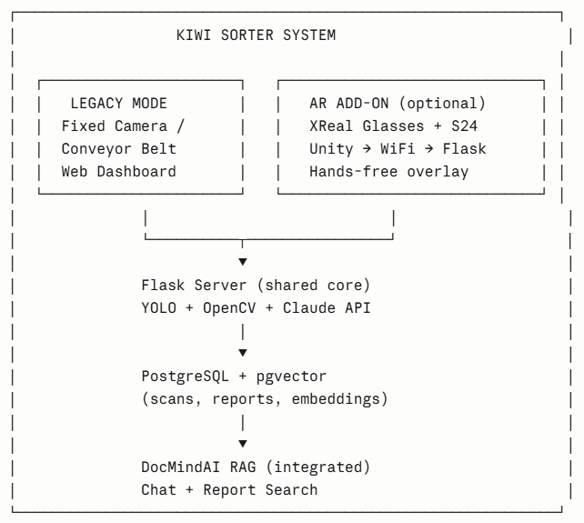

# 🥝 Kiwi Sorter — AI-Powered Produce Inspection System

An end-to-end system that detects fruit, judges its quality with AI, and overlays
the result directly onto the real fruit through **XREAL One AR glasses** — built
for the produce-grading problem at the heart of New Zealand's largest export
sector.

> Solo project · Master of Applied Computing, Lincoln University NZ (2025–2026)



## What it does

Point a camera at fruit and the system tells you, in real time, **what it is,
how big it is, and an AI judgement of its quality, ripeness, defects and shelf
life** — on an operator dashboard, on a phone, and hands-free through AR glasses.
A retrieval-augmented chat layer then answers questions about the scan history
and any uploaded documents.

## The three components

| Component | Stack | What it is |
|-----------|-------|------------|
| **Detection Platform** (`/`) | Flask · YOLOv8 · OpenCV · Claude Vision | Real-time detection, measurement, quality analysis, dashboard, phone scanner, AR endpoints |
| **DocMindAI RAG** (`DocMindAi Dai/`) | Flask · FAISS · PostgreSQL · Claude · BM25 | Document Q&A and scan-history chat with inline citations, hybrid retrieval, analytics, streaming |
| **AR Client** (`KiwiSorterAR2022/`) | Unity · C# · XREAL SDK | World-anchored optical see-through overlay on XREAL One glasses |

Each has its own README. Full technical report:
[`Documentation/PROJECT_REPORT.md`](Documentation/PROJECT_REPORT.md).

## Quick start

```text
1. setup_admin.bat        (once — firewall + PostgreSQL, self-elevating)
2. Kiwi Sorter.hta        (double-click → Start System)
3. Dashboard  http://localhost:5000
   RAG chat   http://localhost:5001
   Phone      https://<laptop-ip>:5443/mobile
4. Stop System  (or stop_all.bat)
```

## Highlights

- **World-anchored AR** that keeps a box glued to real fruit as your head turns
  (3DoF, optical see-through — no video passthrough).
- **Hybrid RAG** (dense + BM25, reciprocal-rank fusion) with **inline citations**
  and **SQL-exact** answers to counting questions.
- **Multi-source routing** — the chatbot knows whether a question is about a
  document, the scan database, or the web, and answers from the right one.
- **Zero-config networking** — the glasses discover the server over UDP on any WiFi.

## Status

Goals 1–5 delivered (detection, AI quality, RAG reports, RAG chat, AR overlay).
Goal 6 (AR hand-tracking) and a custom multi-task model (kiwi detection +
trained ripeness head, distilled from Claude) are scoped as future work —
see [`Documentation/ML_upgrade_plan.md`](Documentation/ML_upgrade_plan.md).

## License

Academic portfolio project. Not for redistribution.
